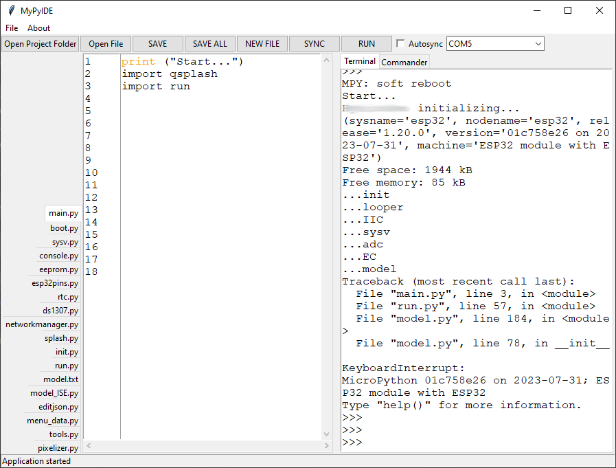

## myupyide - A micropython IDE
An IDE to develop micropython on a microcontroller, with built in terminal and file sync, sharing the same serial connection.

## Pre-release
This version is anything but finished. It is a very rough gem. It is functional. It has dozens of quircks.
I figured i might as well track changes and bring it into the public, since, well, i am using it for a couple of month already for my uC project.

## Screenshot


## Manual & instructions
To-do. 

If you are familiar with micropython, you should be able to figure it out, it is not complicated. All you need is attach a microcontroller that has micropython flashed to it to your PC, launch the editor, and point to a working folder. The buttons and menu should be self-explanatory.

If not, start by installing micropython on your uC, and make sure you can access it over the serial port. Once connected, the editor should work as expected.

## Install
Install a recenty version of Python for your platform. (At the time of writing, this project was made and tested using Python 3.10)

Install needed libraries. This project mostly uses the standard libraries but i may have overlooked some.
```
pip install wx serial pygments pyserial
```

Run the editor main file:
```
python mypyide.py
```

## To-do
Pick a better name

## Remarks on the release
I used visual studio code for this project, but i did not include visual studio's files to the repository.

## Background
This project was born out of necessity. While working on an microcontroller project, I decided to transition my code to MicroPython. 
I was not happy with the available IDE's (Arduino Lab, OpenMV). Hence, i hacked together an IDE that can share the serial connection to the uC board. 

The general idea is, to keep files locally on the PC, have easy synchronization of files to the microcontroller, and have access to the REPL.
This results in a quick turn-around time between making code changes and testing them on the REPL.

I'm using it intensively for some months now, figured i might as well share the code. If it's useful to me, maybe it is for someone else.

## Disclaimer
This project was crafted with the aid of AI to hasten development.

## License
GPL for the editor, MIT for the micropython's pyboard derived library (mypyboard), where i hacked in some small changes.